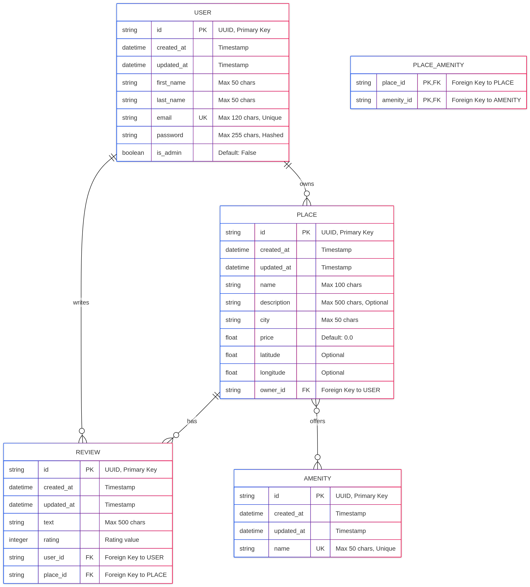

# HBnB Database Entity-Relationship Diagram

## Overview
This document contains the Entity-Relationship (ER) diagram for the HBnB application database schema, visualized using Mermaid.js. The diagram illustrates the structure of all entities (tables) and their relationships.

## Database Schema Diagram

```
```

## Relationship Details

### One-to-Many Relationships

#### USER → PLACE (One-to-Many)
- **Relationship**: A user can own multiple places
- **Foreign Key**: `PLACE.owner_id` references `USER.id`
- **SQLAlchemy**: `User.places` (backref) ↔ `Place.owner`
- **Cardinality**: 1:N (One user to many places)
- **Cascade**: No cascade delete (preserve places if user deleted)

#### USER → REVIEW (One-to-Many)
- **Relationship**: A user can write multiple reviews
- **Foreign Key**: `REVIEW.user_id` references `USER.id`
- **SQLAlchemy**: `User.reviews` (backref) ↔ `Review.user`
- **Cardinality**: 1:N (One user to many reviews)
- **Cascade**: No cascade delete (preserve reviews if user deleted)

#### PLACE → REVIEW (One-to-Many)
- **Relationship**: A place can have multiple reviews
- **Foreign Key**: `REVIEW.place_id` references `PLACE.id`
- **SQLAlchemy**: `Place.reviews` ↔ `Review.place` (backref)
- **Cardinality**: 1:N (One place to many reviews)
- **Cascade**: **CASCADE DELETE** - Reviews are deleted when place is deleted
- **Note**: This is the only relationship with cascade delete behavior

### Many-to-Many Relationship

#### PLACE ↔ AMENITY (Many-to-Many)
- **Relationship**: A place can offer multiple amenities, and an amenity can be offered by multiple places
- **Association Table**: `PLACE_AMENITY`
- **Foreign Keys**:
  - `PLACE_AMENITY.place_id` references `PLACE.id`
  - `PLACE_AMENITY.amenity_id` references `AMENITY.id`
- **SQLAlchemy**: `Place.amenities` ↔ `Amenity.places` (backref)
- **Cardinality**: M:N (Many-to-many)
- **Composite Primary Key**: (`place_id`, `amenity_id`)

## Key Constraints

### Primary Keys
All entities use UUID-based primary keys:
- `USER.id`
- `PLACE.id`
- `REVIEW.id`
- `AMENITY.id`

### Unique Constraints
- `USER.email` - Each email must be unique
- `AMENITY.name` - Each amenity name must be unique

### Foreign Key Constraints
- `PLACE.owner_id` → `USER.id` (NOT NULL)
- `REVIEW.user_id` → `USER.id` (NOT NULL)
- `REVIEW.place_id` → `PLACE.id` (NOT NULL)
- `PLACE_AMENITY.place_id` → `PLACE.id`
- `PLACE_AMENITY.amenity_id` → `AMENITY.id`

### Nullable Fields
- **USER**: All fields are NOT NULL
- **PLACE**: `description`, `latitude`, `longitude` are nullable
- **REVIEW**: All fields are NOT NULL
- **AMENITY**: All fields are NOT NULL

## Business Rules

1. **User Authentication**
   - Passwords are hashed using bcrypt
   - Passwords are never returned in API responses
   - Users can be designated as administrators (`is_admin`)

2. **Place Ownership**
   - Each place must have an owner (user)
   - Owners can update/delete their own places
   - Admins can update/delete any place

3. **Review Constraints**
   - Users cannot review their own places
   - Users cannot submit multiple reviews for the same place
   - Reviews are automatically deleted when the parent place is deleted
   - Only review authors (or admins) can update/delete reviews

4. **Amenity Management**
   - Only administrators can create/update amenities
   - Amenity names must be unique
   - Amenities are shared across multiple places

5. **Timestamps**
   - All entities automatically track `created_at` and `updated_at`
   - Timestamps are in UTC format

## Database Technology

- **ORM**: SQLAlchemy
- **Development Database**: SQLite (`hbnb_dev.db`)
- **Production**: Configurable via `SQLALCHEMY_DATABASE_URI`

## Viewing the Diagram

### On GitHub/GitLab
The Mermaid diagram will render automatically when viewing this file on GitHub or GitLab.

### Using Mermaid Live Editor
1. Visit: https://mermaid.live/
2. Copy the diagram code (between the ```mermaid markers)
3. Paste into the editor to view and export

### In VS Code
Install the "Markdown Preview Mermaid Support" extension to view diagrams in markdown preview.

## Related Files

- **Models**: `app/models/`
  - `user.py` - User entity
  - `place.py` - Place entity and place_amenity association table
  - `review.py` - Review entity
  - `amenity.py` - Amenity entity
  - `base_model.py` - Base model with common fields

- **SQL Scripts**: `sql/`
  - `schema.sql` - Complete database schema
  - `seed.sql` - Initial data (admin user, amenities)
  - `data.sql` - Sample test data

- **Repositories**: `app/persistence/`
  - Entity-specific repositories implementing CRUD operations

## Diagram Legend

| Symbol | Meaning |
|--------|---------|
| PK | Primary Key |
| FK | Foreign Key |
| UK | Unique Key |
| \|\|--o{ | One-to-Many relationship |
| }o--o{ | Many-to-Many relationship |

## Notes

- All IDs are stored as strings (UUID format: 36 characters)
- The `PLACE_AMENITY` table is an association table and is not exposed as a model in the application layer
- Relationships are bidirectional in SQLAlchemy (using `backref`)
- The diagram follows the actual implementation in `app/models/`
